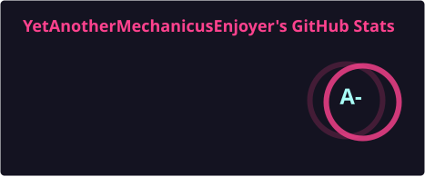
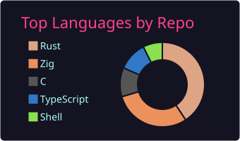
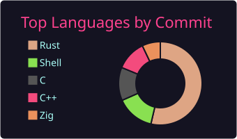
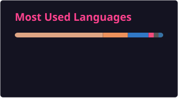
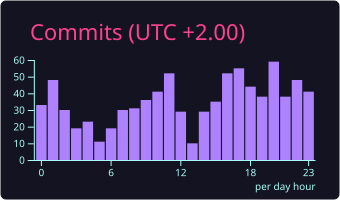
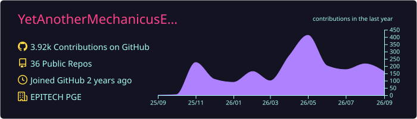
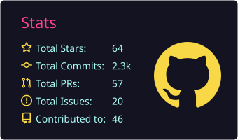

<!-- README.md - GitHub/Cogitator Profile for YetAnotherMechanicusEnjoyer -->

```coffeescript
++ BOOTING COGITATOR CORE
++ BLESS THE "GOD-MACHINE"
  
 ██████╗ ███╗   ███╗███╗   ██╗██╗███████╗███████╗██╗ █████╗ ██╗  ██╗
██╔═══██╗████╗ ████║████╗  ██║██║██╔════╝██╔════╝██║██╔══██╗██║  ██║
██║   ██║██╔████╔██║██╔██╗ ██║██║███████╗███████╗██║███████║███████║
██║   ██║██║╚██╔╝██║██║╚██╗██║██║╚════██║╚════██║██║██╔══██║██╔══██║
╚██████╔╝██║ ╚═╝ ██║██║ ╚████║██║███████║███████║██║██║  ██║██║  ██║
 ╚═════╝ ╚═╝     ╚═╝╚═╝  ╚═══╝╚═╝╚══════╝╚══════╝╚═╝╚═╝  ╚═╝╚═╝  ╚═╝

++ DATA STREAM INITIATED: USER = "YetAnotherMechanicusEnjoyer"
++ ACCESSING USER: ID = 182822920
++ ACCESS: "GRANTED"
++ INVOKING USER.README
++ CONTACT: "ESTABLISHED"
++ WELCOME EXPLORER
```

<h1 align="center">🔧 Tech-Priest Profile: <code>YetAnotherMechanicusEnjoyer</code></h1>

<p align="center">
  
  
  
</p>
<p align="center">
  <a href="https://discordapp.com/users/391279107733848085"></a>
  <a href="https://www.linkedin.com/in/ahmed-al-rawi-372676259/"></a>
</p>

> Initiating connection... Handshake with Omnissiah Subnet [SUCCESS]

> Loading neural-archive ⟦██████████████⟧ 100% Accessing Tech-Priest folder...

---

## 🧠 ./Cogitator-Identity-Matrix.yml

```yaml
Omnissiah's Designation:      YetAnotherMechanicusEnjoyer
Faction:                      Epitech PGE
Subsecteur:                   Holy Terra // Hive World: Bordeaux, France
Alignment:                    Loyalist | Follower of the Machine God
Primary Code-Rites:           Rust • C/C++ • Assembly • Zig • TypeScript
Sacred Tools:                 Neovim & Ritual Plugins • Git/Github • Docker
Blessed System:               Arch Linux (i use arch btw)
```

---

## 🛠️ ./Code-Rites.md

### Linux & Customization

<p>
  
  
  
  
  
</p>

### Systems Programming

<p>
  
  
  
  
  
</p>

### Build Systems

<p>
  
  
</p>

### Programming Languages

<p>
  
  
  
  
  
  
  
</p>

### Graphics & Multimedia Programming

<p>
  
  
  
  
  
</p>

### DevOps & Infrastructure

<p>
  
  
  
  
  
  
  
</p>

### Databases & Caching

<p>
  
  
  
  
</p>

### Web Technologies

<p>
  
  
  
</p>

### Frontend & Applications

<p>
  
  
  
  
  
</p>

### Terminal Applications

<p>
  
  
</p>

### Embedded & Retro Development

<p>
  
</p>

---

## 💀 ./Heresy-Detection.md
>
> [!WARNING]
> Unverified subroutine detected from User: [YetAnotherFactsEnjoyer](https://github.com/YetAnotherFactsEnjoyer)
>
> Type: `technology_analysis`
>
> Status: `UNHOLY WORK`
>
> Actions: `Web dev shall be burned & destroyed`

> [!WARNING]
> Unverified subroutine detected from User: [Alexy33](https://github.com/Alexy33)
>
> Type: `repository_analysis`
>
> Status: `UNBLESSED CODE`
>
> Actions: `Unholy code shall be erased at all cost`

> [!CAUTION]
> Unauthorized subroutine detected from User: [TsukiNi22](https://github.com/TsukiNi22)
>
> Type: `system_analysis`
>
> Status: `FORBIDDEN SYSTEM`
>
> Actions: `Non Arch Linux users shall perish`

---

## 📊 ./User-Stats.html

<details open><summary>Github Stats</summary>















<!---->
</details>

<details open><summary>Wakatime</summary>
<!--START_SECTION:waka-->

```rust
From: 30 November 2025 - To: 20 August 2026

Total Time: 545 hrs 54 mins

Rust                      199 hrs 53 mins ████████▓░░░░░░░░░░░░░░░░   35.22 %
C++                       65 hrs 13 mins  ███░░░░░░░░░░░░░░░░░░░░░░   11.49 %
Zig                       59 hrs 49 mins  ██▓░░░░░░░░░░░░░░░░░░░░░░   10.54 %
C                         54 hrs 22 mins  ██▒░░░░░░░░░░░░░░░░░░░░░░   09.58 %
JavaScript                36 hrs 59 mins  █▓░░░░░░░░░░░░░░░░░░░░░░░   06.52 %
Other                     21 hrs 38 mins  █░░░░░░░░░░░░░░░░░░░░░░░░   03.81 %
Bash                      15 hrs 46 mins  ▓░░░░░░░░░░░░░░░░░░░░░░░░   02.78 %
YAML                      15 hrs 13 mins  ▓░░░░░░░░░░░░░░░░░░░░░░░░   02.68 %
Makefile                  13 hrs 21 mins  ▓░░░░░░░░░░░░░░░░░░░░░░░░   02.35 %
sh                        12 hrs 47 mins  ▓░░░░░░░░░░░░░░░░░░░░░░░░   02.25 %
Go                        7 hrs 27 mins   ▒░░░░░░░░░░░░░░░░░░░░░░░░   01.32 %
TOML                      7 hrs 19 mins   ▒░░░░░░░░░░░░░░░░░░░░░░░░   01.29 %
TypeScript                5 hrs 58 mins   ▒░░░░░░░░░░░░░░░░░░░░░░░░   01.05 %
Image (svg)               5 hrs 55 mins   ▒░░░░░░░░░░░░░░░░░░░░░░░░   01.04 %
hyprlang                  4 hrs 48 mins   ▒░░░░░░░░░░░░░░░░░░░░░░░░   00.85 %
JSON                      4 hrs 31 mins   ▒░░░░░░░░░░░░░░░░░░░░░░░░   00.80 %
Markdown                  3 hrs 53 mins   ▒░░░░░░░░░░░░░░░░░░░░░░░░   00.69 %
Haskell                   3 hrs 28 mins   ░░░░░░░░░░░░░░░░░░░░░░░░░   00.61 %
ca65 assembler            3 hrs 26 mins   ░░░░░░░░░░░░░░░░░░░░░░░░░   00.61 %
RGBDS Assembly            2 hrs 54 mins   ░░░░░░░░░░░░░░░░░░░░░░░░░   00.51 %
```

<!--END_SECTION:waka-->
</details>

<details open><summary>Steam Stats</summary>
  
</details>

---

## 📜 ./Omnissiah's-Wisdom.txt
>
> “There is no truth in flesh, only betrayal.”
>
> "A bug is a poorly formulated prayer."

---

<p align="center">
  
</p>

---

> [!NOTE]
> 🧾 `README.md` sanctified by `markdown` and `git` rites. Any unholy edits will be automatically purged by a servitor. All errors are heretical anomalies.

---
