<!-- README.md - GitHub/Cogitator Profile for YetAnotherMechanicusEnjoyer -->

```coffeescript
++ BOOTING COGITATOR CORE
++ BLESS THE "GOD-MACHINE"
  
 ██████╗ ███╗   ███╗███╗   ██╗██╗███████╗███████╗██╗ █████╗ ██╗  ██╗
██╔═══██╗████╗ ████║████╗  ██║██║██╔════╝██╔════╝██║██╔══██╗██║  ██║
██║   ██║██╔████╔██║██╔██╗ ██║██║███████╗███████╗██║███████║███████║
██║   ██║██║╚██╔╝██║██║╚██╗██║██║╚════██║╚════██║██║██╔══██║██╔══██║
╚██████╔╝██║ ╚═╝ ██║██║ ╚████║██║███████║███████║██║██║  ██║██║  ██║
 ╚═════╝ ╚═╝     ╚═╝╚═╝  ╚═══╝╚═╝╚══════╝╚══════╝╚═╝╚═╝  ╚═╝╚═╝  ╚═╝

++ DATA STREAM INITIATED: USER = "YetAnotherMechanicusEnjoyer"
++ ACCESSING USER: ID = 182822920
++ ACCESS: "GRANTED"
++ INVOKING USER.README
++ CONTACT: "ESTABLISHED"
++ WELCOME EXPLORER
```

<h1 align="center">🔧 Tech-Priest Profile: <code>YetAnotherMechanicusEnjoyer</code></h1>

<p align="center">
  
  
  
</p>
<p align="center">
  <a href="https://discordapp.com/users/391279107733848085"></a>
  <a href="https://www.linkedin.com/in/ahmed-al-rawi-372676259/"></a>
</p>

> Initiating connection... Handshake with Omnissiah Subnet [SUCCESS]

> Loading neural-archive ⟦██████████████⟧ 100% Accessing Tech-Priest folder...

---

## 🧠 ./Cogitator-Identity-Matrix.yml

```yaml
Omnissiah's Designation:      YetAnotherMechanicusEnjoyer
Faction:                      Epitech PGE
Subsecteur:                   Holy Terra // Hive World: Bordeaux, France
Alignment:                    Loyalist | Follower of the Machine God
Primary Code-Rites:           C • Lua • Rust • JavaScript • Python
Sacred Tools:                 Neovim & Ritual Plugins • Git • CSFML
Blessed System:               Arch Linux (i use arch btw)
```

---

## 🛠️ ./Code-Rites.md

### OS
 

### Low-level
    

### High-level
    

### Tools
  

### Databases
  

### Front
       

---

## 💀 ./Heresy-Detection.md
> [!WARNING]
> Unverified subroutine detected from User : [Alexy33](https://github.com/Alexy33)
> 
> Type: `repository_analysis`
>
> Status: `UNBLESSED CODE`
>
> Actions: `Unholy code shall be erased at all cost`

> [!CAUTION]
> Unauthorized subroutine detected from User : [TsukiNi22](https://github.com/TsukiNi22)
>
> Type: `system_analysis`
>
> Status: `FORBIDDEN SYSTEM`
>
> Actions: `Non Arch Linux users shall perish`

---

## 📊 ./User-Stats.html
<details open><summary>Github Stats</summary>




<!---->
</details>

<details open><summary>Wakatime</summary>
<!--START_SECTION:waka-->

```rust
From: 30 November 2025 - To: 23 January 2026

Total Time: 88 hrs 55 mins

JavaScript     36 hrs 43 mins  ████████▓░░░░░░░░░░░░░░░░   34.72 %
Other          16 hrs 50 mins  ████░░░░░░░░░░░░░░░░░░░░░   15.92 %
Rust           9 hrs 44 mins   ██▒░░░░░░░░░░░░░░░░░░░░░░   09.21 %
C++            9 hrs 34 mins   ██▒░░░░░░░░░░░░░░░░░░░░░░   09.05 %
C              7 hrs 10 mins   █▓░░░░░░░░░░░░░░░░░░░░░░░   06.79 %
Image (svg)    5 hrs 51 mins   █▒░░░░░░░░░░░░░░░░░░░░░░░   05.54 %
YAML           4 hrs 40 mins   █░░░░░░░░░░░░░░░░░░░░░░░░   04.42 %
Haskell        3 hrs 28 mins   ▓░░░░░░░░░░░░░░░░░░░░░░░░   03.28 %
Makefile       3 hrs 21 mins   ▓░░░░░░░░░░░░░░░░░░░░░░░░   03.18 %
Bash           1 hr 58 mins    ▒░░░░░░░░░░░░░░░░░░░░░░░░   01.88 %
hyprlang       1 hr 31 mins    ▒░░░░░░░░░░░░░░░░░░░░░░░░   01.44 %
Docker         46 mins         ▒░░░░░░░░░░░░░░░░░░░░░░░░   00.73 %
gitignore      45 mins         ▒░░░░░░░░░░░░░░░░░░░░░░░░   00.72 %
TOML           33 mins         ░░░░░░░░░░░░░░░░░░░░░░░░░   00.52 %
tmux           29 mins         ░░░░░░░░░░░░░░░░░░░░░░░░░   00.46 %
Markdown       27 mins         ░░░░░░░░░░░░░░░░░░░░░░░░░   00.44 %
conf           20 mins         ░░░░░░░░░░░░░░░░░░░░░░░░░   00.33 %
swayconfig     17 mins         ░░░░░░░░░░░░░░░░░░░░░░░░░   00.27 %
Objective-C    16 mins         ░░░░░░░░░░░░░░░░░░░░░░░░░   00.27 %
JSON           16 mins         ░░░░░░░░░░░░░░░░░░░░░░░░░   00.27 %
```

<!--END_SECTION:waka-->
</details>

<details open><summary>Steam Stats</summary>
  
</details>

---

## 📜 ./Omnissiah's-Wisdom.txt
> “There is no truth in flesh, only betrayal.”
> 
> "A bug is a poorly formulated prayer."

---

<p align="center">  </p>

---

> [!NOTE]
> 🧾 `README.md` sanctified by `markdown` and `git` rites. Any unholy edits will be automatically purged by a servitor. All errors are heretical anomalies.

---
